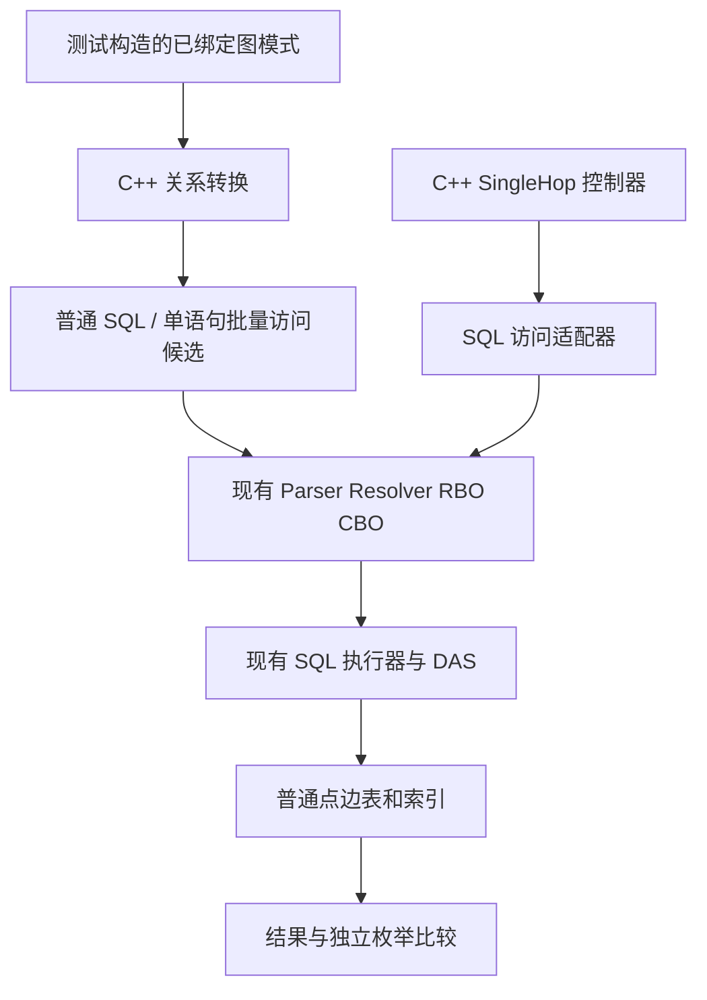

# seekdb 图功能 P0：复用决策、生命周期与后续任务

## 1. 历史原型验证路线

独立原型及其专用 CI 已移除。以下原型结构、生命周期和实验结论保留为历史设计参考，不代表当前分支提供可执行原型。当前保留的自动化用例位于 `tools/deploy/mysql_test/test_suite/graph`，通过现有 mysqltest runner 执行；正式 SQL 入口和内核行为没有改变。

固定模式 IR 明确保存顶点变量、边变量、方向、映射表、投影、过滤和显式不同边约束；当前仅测试 BIGINT 两列键。

单语句候选先形成不同源键集合，读取关联边，再形成不同目标键集合、检查目标点，最后按输入绑定恢复结果。其 CTE 可以由 CBO 内联或物化；EXPLAIN 和实测才是物理执行证据，SQL 文本中的 DISTINCT 不等于底层仅访问一次。

分页控制器在真实 seekdb 连接上执行读边与回查。页内目标键去重，输入绑定不去重；边按稳定复合主键分页，不使用 OFFSET，因此不会因页大小改变结果。它验证协议，但不验证生产环境多跳内核算子。

## 2. 复用边界与当前决策

| 模块 | 决策 | 接入位置与限制 |
| --- | --- | --- |
| Schema | P1 新增图映射元数据，继续引用现有表 | `src/share/schema/ob_table_schema.h` 是基表基础；持久化和依赖尚需新增 |
| 前端 | P1 新增 SQL/PGQ 语法和绑定，沿用现有 SQL 表达式 | `sql_parser_mysql_mode.y`、`ob_select_resolver.cpp`；原型没有生产 Parser |
| 固定模式 | 优先降为普通关系操作 | P0 输出 SQL，P1 改为直接构造绑定后的关系树，避免字符串往返和重复解析 |
| RBO/CBO | 固定模式沿用原有优化器 | 本次不增加图统计、成本函数或图标记 |
| 单跳 | P1 使用现有 Scan/Join；P2 复用扫描和批量回查基础 | SQL 组合实测可运行，不能视为已验证独立图 DAS 算子 |
| DAS 框架 | 本次不新增 TaskOp，也不预先选 Attach | 原型没有证明必须扩展 DAS 运行框架；P2 在进程内适配时再以明确缺口决定 |
| 存储 | 普通表、正反向索引、现有 MVCC | 不增加持久化邻接结构或独立同步链路 |
| 测试 | 现有 mysqltest runner | 保留 graph.semantics、graph.transaction；独立 CMake/CTest 和原型集成驱动已移除 |

DAS 源码复用依据：`ObDASScanOp` 将事务、snapshot 和 key_ranges 传到 scan_param；`ObDASIterUtils` 已组织扫描及多种 lookup 子树；`ObDASIter` 有 init/reuse/release 与批量读取接口。上述接口不是可以脱离 ExecContext/EvalContext 直接调用的独立数据库客户端。

## 3. 生命周期和资源

| 对象 | P0 持有者与生命周期 | P2 进程内要求 |
| --- | --- | --- |
| 模式/映射 | 测试进程，转换调用内 | 编译期绑定，依赖 Schema 版本 |
| 输入绑定 | SingleHop 调用内；binding_id 唯一 | 来自上游批次，跨输出暂停保持关联 |
| 端点存在性集合 | 调用内源集合、页内目标集合 | 沿用同一语句快照；必要校验不能被投影裁剪移除 |
| 边缓冲 | 一页；消费完后替换 | 由查询 allocator 统一计费 |
| 输出 | 逐条恢复绑定，不物化边数乘绑定数 | 接入 get_next_batch 和上游背压 |
| 快照 | 单语句 SQL 由服务端持有；客户端控制器为 RR 事务 | 直接继承调用方事务、语句快照和 Schema guard，不另开事务 |
| 取消/错误 | C++ check 回调和异常；SqlAccess RAII 回滚并关连接 | 使用现有算子 check_status；统一 release 路径 |
| rescan | 丢弃本轮缓冲和计数，重新 open | 接入 ObOperator::inner_rescan 和 DAS reuse，不残留路径历史 |

控制器允许 1..4096 的页容量、至多 4096 个输入绑定，超限明确失败。控制器预算是测试策略额度，不包含 MySQL 库和服务端内存，不能作为生产查询内存保护实现。

同源点访问仅在映射、方向和过滤条件相同的一次调用内共享。跨图、跨过滤条件、跨快照不共享缓存。多跳中只共享邻接读取，不能合并路径身份历史。

## 4. 实施后的验收清单

| 交付物 | 当前证据 | 未由本证据覆盖的范围 |
| --- | --- | --- |
| 语言与语义契约 | p0-contract.md、能力矩阵、目标 SQL 示例 | Oracle/DuckPGQ 二进制兼容认证 |
| 关系转换原型 | C++ IR → SQL → 实际 seekdb 结果，与独立枚举比较 | 直接生成内核关系树、正式 Parser |
| 单跳原型 | 单语句 SQL 候选 + C++ 分页控制器真实读库 | 直接 ObDASIter 适配、Attach、生产算子快照接口 |
| 正确性 | 手工 mysqltest、随机多重集差分、协议故障测试 | 完整可选图语法、无向转换、任意类型键 |
| 事务与取消 | 双连接一致性事务、自己的删除、回滚、真实查询 KILL | 并发 Schema 演进、生产图对象权限 |
| 基线 | 固定种子、三种度分布、EXPLAIN、延迟、CPU/RSS 采样 | 存储实际检查边数、生产尾延迟、内核精确内存归属 |

P0 的协议和关系访问实验可以作为 P1 开发输入。**若验收要求直接在内核实例化 DAS 图迭代器，则该项仍未完成，不能用 SQL 客户端适配器替代其验收。** 当前实现保留这个边界，没有新增未经构建验证的内核适配代码。

## 5. P1/P2 工作包

| 工作包 | 依赖 | 实现内容 | 完成标准 |
| --- | --- | --- | --- |
| P1 Schema/DDL | 本契约 | 图对象持久化，点边映射和 PK 校验，Label、属性、端点引用，基表依赖 | CREATE/DROP、重启恢复、错误映射、破坏性 DDL 和权限 mysqltest |
| P1 Parser/Resolver | Schema | CREATE PROPERTY GRAPH / GRAPH_TABLE / MATCH / COLUMNS，变量绑定和属性类型推导 | 契约正反例真实通过，不支持项有明确错误 |
| P1 关系转换 | Resolver | 把 P0 转换规则接到内部关系树，补无向自环、固定分叉/环、可选模式及作用域 | 图入口与独立 SQL 按 bag 等价，普通 SQL 回归通过 |
| P1 计划生命周期 | Schema/Resolver | 图和基表版本依赖、计划失效、EXPLAIN | DML 不复制数据，DDL 不复用失效计划 |
| P2 单跳内核适配 | P1、P0 协议 | 从 Scan/Lookup 组合开始，在真实 ExecContext 下验证关联、批次、快照、reuse/release | 同一语句更新可见性及取消测试，真实 allocator 预算，必要时才引入 Attach |
| P2 路径控制 | 单跳接口 | 有界循环、零跳、方向、WALK/显式边不重复、路径身份输出 | 合流保留重数，控制与访问分离，无静默截断 |
| P2 诊断与成本 | 实际访问统计 | 查询内边检查/回查/状态计数，先用保守估计与已有统计 | 解释估计与实际差距，资源耗尽明确失败 |

不在缺少内核适配证据时给工期承诺。直接迭代器接入、查询级预算和真实读取计数属于后续详细设计中必须补齐的验证，不因原型测试通过而自动关闭。
